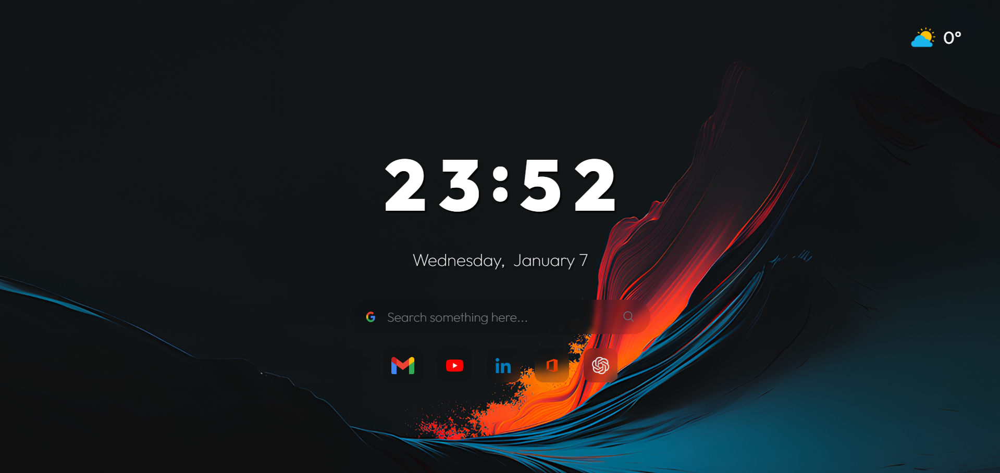
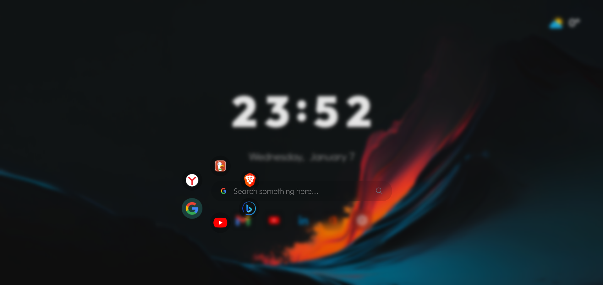
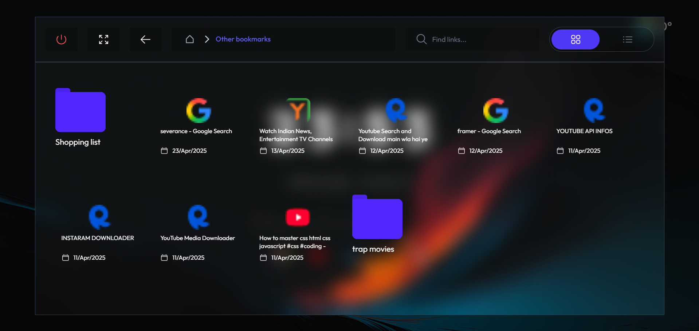
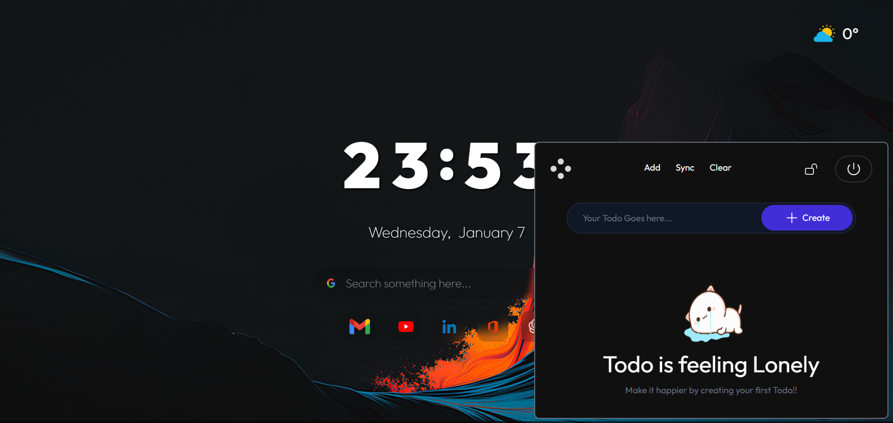

# Rica-Homepage 🌐


---

## 🔹 Overview

**Rica-Homepage** is a modern, customizable browser homepage built with React.  
It transforms your new tab into a **personalized dashboard** with useful widgets and a clean design.  

Key functionalities include:
- Weather display for your location.
- Todo list creation and management.
- Custom wallpapers (upload your own images).
- Bookmark management synced with your browser.
- Smooth animations using **Framer Motion** for interactive UI.
- Fully responsive and minimalistic design for a clean browsing experience.

---

## 🔹 Screenshots

| HomePage | Search Options |
|-----------|-----------|
|  |  | 
| Bookmarks Page | Todo Page |
|  |  |
| Settings Page |  |
|  |  |


---

## 🔹 Features

- **Custom Greeting:** Set your name to personalize the homepage.  
- **Weather Widget:** Displays current weather based on your location.  
- **Todo List:** Create, edit, and save todos locally.  
- **Wallpaper Customization:** Upload your own images or choose from default backgrounds.  
- **Bookmarks Tab:** View and access your synced browser bookmarks.  
- **Smooth Animations:** Interactive UI transitions powered by **Framer Motion**.  
- **IndexedDB Storage:** All custom wallpapers and todos are saved locally for persistent use.  
- **Responsive Design:** Looks great on any screen size.  

---

## 🔹 Tech Stack

- **Frontend:** React  
- **Styling:** Tailwind CSS  
- **Animations:** Framer Motion  
- **Local Storage / DB:** IndexedDB via `idb`  
- **Optional Libraries:**  
  - react-icons  
  - framer-motion  
  - idb  

---

## 🔹 Installation

1. Clone the repository:  
```bash
git clone https://github.com/prasad-pranay/homepage-rica.git
